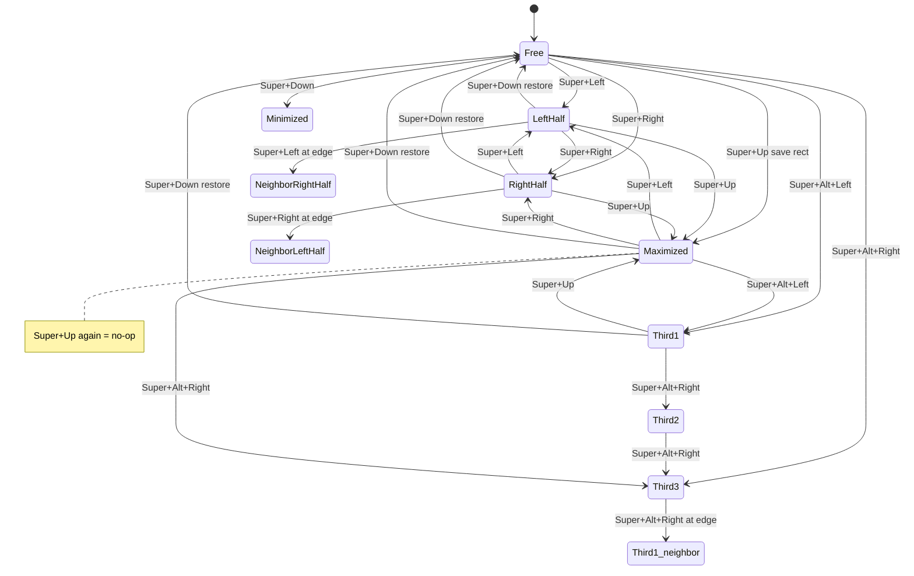

# Dead Simple Tiling (DSTiling) — Design & Build Record

> **Status: implemented & verified on GNOME Shell 50.3 (Bazzite, Wayland).**
> This document was the original plan and is now updated to match the **as-built** code.
> Changes from the initial plan are noted inline ( ➕ added, ✏️ changed ).

A minimal GNOME Shell extension that gives Windows-style window snapping, with a
strong bias toward **correctness** and **simplicity** over features.

---

## 1. Goals & Non-Goals

### Goals

- **Dead simple.** Only the core behaviors a daily-driver needs.
- **Correct.** Predictable state machine, no animations, no flicker, no stale state.
- **Windows-like.** Snapping halves **➕ and thirds**, cross-monitor traversal, and
  maximize/restore/minimize.
- **No external dependencies.** Plain JavaScript (ESM), no TypeScript, no NPM.
- **GNOME 45+** (developed/tested on GNOME 46 & 50).

### Non-Goals (explicitly out of scope)

- No animations / previews.
- ✏️ **No preferences UI at all.** (Initially a trivial "no options" `prefs.js` was planned,
  but it errored on GNOME 50's prefs loader; since there are no options anyway, it was
  removed outright. The gschema only exists because `Main.wm.addKeybinding()` needs a key.)
- No editable / custom layouts.
- No configurable shortcuts (defaults are hardcoded).
- No quarter tiling (Super+Up/Down are reserved for maximize/minimize, so corners are
  impossible by design).
- No vertical halves/thirds (top/bottom), no gaps, no auto-tiling, no snap-assist popups.

---

## 2. Technology & Build

| Concern     | Choice                                                                                |
| ----------- | ------------------------------------------------------------------------------------- |
| Language    | Plain JavaScript, ES modules (GNOME 45+ native ESM loader)                            |
| Build step  | **None** for code. Only `glib-compile-schemas` for the gschema (GNOME SDK tool).      |
| Package mgr | None. A small `Makefile` compiles schemas, installs, and zips the extension.          |
| Imports     | `gi://Meta`, `gi://GLib`, `gi://Gio`, `gi://Shell`, `resource:///org/gnome/shell/...` |
| Target      | `shell-version`: 45, 46, 47, 48, 49, 50                                               |

---

## 3. File Structure

✏️ `prefs.js` removed (no preferences UI).

```
DSTiling/
├── metadata.json          # uuid, name, shell-version, settings-schema
├── extension.js           # entry point: enable/disable, orchestration, signals
├── snap.js                # THE BRAIN: geometry helpers + snap/thirds/maximize/restore/minimize
├── keybindings.js         # register 6 shortcuts + override/restore native keys (crash-safe)
├── schemas/
│   └── org.gnome.shell.extensions.dstiling.gschema.xml
├── Makefile               # `make schemas` + `make package` + `make install`
├── .gitignore
├── README.md              # install/test instructions
└── PLAN.md                # this file
```

Three logic modules keep concerns clean without over-engineering:

- [`snap.js`](snap.js) — all geometry math + the action handlers (halves, thirds, maximize, restore, minimize, drag-unsnap, refit).
- [`keybindings.js`](keybindings.js) — binding plumbing + native key override/restore (crash-safe).
- [`extension.js`](extension.js) — lifecycle, signal wiring (drag-unsnap, workarea re-fit).

---

## 4. Keybindings

➕ Two thirds shortcuts (`Super+Alt+Left/Right`) were added, repurposing the native
workspace-switch keys.

| Action                | Default             | Overrides native (set to `[]`, except `edge-tiling`)             |
| --------------------- | ------------------- | ---------------------------------------------------------------- |
| `snap-left`           | `<Super>Left`       | `org.gnome.mutter.keybindings` → `toggle-tiled-left`             |
| `snap-right`          | `<Super>Right`      | `org.gnome.mutter.keybindings` → `toggle-tiled-right`            |
| ➕ `snap-third-left`  | `<Super><Alt>Left`  | `org.gnome.desktop.wm.keybindings` → `switch-to-workspace-left`  |
| ➕ `snap-third-right` | `<Super><Alt>Right` | `org.gnome.desktop.wm.keybindings` → `switch-to-workspace-right` |
| `toggle-maximize`     | `<Super>Up`         | `org.gnome.desktop.wm.keybindings` → `maximize`                  |
| `restore-minimize`    | `<Super>Down`       | `org.gnome.desktop.wm.keybindings` → `unmaximize`                |

Additionally we disable GNOME's native **drag-to-edge** snapping:
`org.gnome.mutter` → `edge-tiling = false` (so dragging a window never auto-snaps;
we own the snap model).

Every native override is backed up before being changed and **restored on disable**.
Backups are also persisted to a hidden gschema key (`native-backup`, JSON) so that if
GNOME Shell crashes or the extension is force-removed, the user's original shortcuts are
restored on next load. (This is the same class of bug that made TilingShell fragile, so
crash-safety is a hard requirement.)

---

## 5. Window State Model

✏️ A **thirds** state was added alongside halves. Each window is in exactly one of:
**FREE**, **LEFT-half**, **RIGHT-half**, **THIRD-1 / THIRD-2 / THIRD-3**, **MAXIMIZED**.
Halves and thirds are **mutually exclusive** (entering one clears the other).

- **MAXIMIZED** is read from the authoritative Meta flags
  (`maximizedHorizontally && maximizedVertically`) — never from our own state.
- **LEFT/RIGHT** is tracked in `WeakMap<window, 'left'|'right'>` (`_snapped`).
- ➕ **THIRD column** is tracked in `WeakMap<window, 1|2|3>` (`_thirds`).
- Both are updated on **every** transition we perform (snap, thirds, maximize, restore,
  drag-unsnap, cross-monitor). Tracking them — instead of re-deriving from an exact
  geometry match — keeps behaviour correct even if the user **manually resizes** a snapped
  window: `Super+Down` still restores it rather than minimizing. The only untracked
  mutations are ones we never observe (rare: we disable native edge-tiling; a drag clears it).

We also store each window's **original pre-snap geometry** in
`WeakMap<window, {x,y,w,h}>` (`_savedRects`, auto-cleaned on close — no manual cleanup).
Captured the moment a free window becomes snapped or maximized; cleared when it returns
to free (via `Super+Down` or drag-unsnap).

### Window guards (skip the action entirely if any fail)

- window exists & has focus, `windowType === NORMAL`, `wm_class !== 'gjs'`, not fullscreen.
- `allows_move()` / `allows_resize()` — ✏️ applied **only to the non-maximized** snap
  paths (see §8: maximized windows report these as `false`, so the maximized branch must
  run first). `can_maximize()` / `can_minimize()` for those respective actions.

---

## 6. Snap Logic — halves (`snapLeft()` / `snapRight()`)

Halves are computed from the **work area** (excludes top bar / docks), no gaps (true
Windows behavior — halves touch).

### `snapLeft()`

| Current state                 | Action                                                                                  |
| ----------------------------- | --------------------------------------------------------------------------------------- |
| maximized                     | unmaximize, then snap to **left half of current monitor**                               |
| free                          | save rect, snap to **left half of current monitor**                                     |
| already left half (this mon.) | if a monitor exists to the **left**: snap to **right half** of it; else no-op (clamped) |
| right half (this mon.)        | snap to **left half of current monitor**                                                |

### `snapRight()` — mirror of the above.

**Worked example (monitors A–B–C, window restored on B):**

1. `Super+Left` → left half of B
2. `Super+Left` → already left of B, neighbor left = A → **right half of A**
3. `Super+Left` → now right half of A → **left half of A**
4. `Super+Left` → already left of A, no left neighbor → no-op

Cross-monitor placement uses `window.move_resize_frame(true, x, y, w, h)`; the window's
`get_monitor()` updates automatically from its new position, and it stays focused.

---

## ➕ 6b. Snap Logic — thirds (`snapThirdLeft()` / `snapThirdRight()`)

The monitor is split into 3 equal columns **[1][2][3]** (last column absorbs the
remainder). `Super+Alt+Arrow` walks the window **one column at a time** and crosses
monitors at the edge — the same model as halves.

| `snapThirdLeft` (←)                                      | `snapThirdRight` (→)                                       |
| -------------------------------------------------------- | ---------------------------------------------------------- |
| maximized → unmaximize → **col 1**                       | maximized → unmaximize → **col 3**                         |
| not a third → **col 1**                                  | not a third → **col 3**                                    |
| col 2 → col 1 ; col 3 → col 2                            | col 1 → col 2 ; col 2 → col 3                              |
| col 1 (left edge) → **col 3 of left monitor** (or clamp) | col 3 (right edge) → **col 1 of right monitor** (or clamp) |

Thirds share the same saved-rect model: `Super+Down` or dragging returns the window to
its original size.

---

## 7. Maximize / Restore / Minimize — state machine

Confirmed decision (Windows-exact):

- **`toggleMaximize()` (Super+Up):** maximized → **no-op**; free/half/third → save rect
  (if free), clear half+third, then `maximize()`.
- **`restoreOrMinimize()` (Super+Down):** walk _down_ the chain
    - maximized → **free** (restore — see §7b)
    - half/third → **free** (restore to saved rect)
    - free → `minimize()`

Repeated `Super+Down`: **maximized → (free) → minimized** =
"maximize ↔ restore ↔ minimize, always in this order".



### ➕ 7b. Robust restore from maximized (validated target + idle deferral)

Mutter restores a maximized window to _its own_ internal "saved rect" on unmaximize,
which is sometimes still the maximized size (especially for windows maximized by the app
or another tool, whose real pre-maximize size we never observed). Restoring to that = no
visible change. The fix has two parts:

1. **Validate the target — `_freeTarget()`.** Use the remembered original **only if** it is
   genuinely smaller than the work area (`_isFullSize`: width & height ≥ 95% of work area);
   otherwise fall back to a **centered 2/3-of-screen** default. This _guarantees_ the result
   is smaller than maximized.
2. **Idle-defer the apply — `_defer()`** via `GLib.idle_add`. `unmaximize()` now, then apply
   the validated target on the next tick so our rect is the final one (after Mutter's own
   async restore settles).

Both parts are required: deferral alone can't fix a bad remembered size; validation alone
can't win the async race.

---

## 8. ✏️ GNOME 49/50 compatibility notes

Compatibility issues found during testing:

- **`maximize()`/`unmaximize()` take 0 arguments as of GNOME 49** (GNOME 45-48
  still take `Meta.MaximizeFlags.BOTH`). `snap.js` version-detects via
  `Config.PACKAGE_VERSION` (`>= 49` → no args). The flags value is resolved into a
  local once (`_MAXIMIZE_BOTH`) and passed indirectly — passing `Meta.MaximizeFlags`
  inline as the argument is exactly what GNOME 49's review check (EGO-C49-003)
  flags.
- **Maximized windows report `allows_move()`/`allows_resize()` as `false`.** The original
  guard ran _before_ the maximized→snap branch, making `Super+Arrow` from a maximized
  window a no-op. Fix: in every snap/third handler, the **maximized branch runs first**,
  and the move/resize guard applies only to the non-maximized paths.
- ✏️ **`prefs.js` removed** — its `resource:///org/gnome/shell/extensions/extension.js`
  import failed under GNOME 50's prefs loader; there are no options anyway.

---

## 9. Drag-to-Unsnap

On `global.display` `'grab-op-begin'` for a **move** op (`Meta.GrabOp.MOVING`): if the
grabbed window is currently half-tiled **or a third**, stage its saved rect + position;
on `'grab-op-end'`, if the window actually moved, restore the **original size** at the drop
position (exactly like Windows). A click without movement leaves it snapped.
Programmatic `move_resize_frame`/`maximize` calls do **not** fire grab-op, so our own
snapping is unaffected.

---

## 10. Workarea Re-fit

On `Main.layoutManager` `'workareas-changed'` (panel/dock shown or hidden, resolution
change), every currently half- or third-tiled window is re-applied so it stays aligned to
the new work area. Iterate `active_workspace.list_windows()`, re-apply each tracked tile.
(Free / maximized windows are left alone.)

---

## 11. Lifecycle (`extension.js`)

- **`enable()`**
    1. `new Snap()` (sets up the WeakMaps).
    2. `new Keybindings(getSettings(), snap)` → `enable()` (overrides natives, registers 6
       bindings, disables native edge-tiling).
    3. Connect `global.display` `'grab-op-begin'`/`'grab-op-end'` → `snap.onGrabBegin/End`.
    4. Connect `Main.layoutManager` `'workareas-changed'` → `snap.refitAll()`.
- **`disable()`**
    1. Disconnect all signals.
    2. `keybindings.disable()` (restores all native overrides + edge-tiling, clears backup).
    3. `snap.destroy()`; null out references.

All signal connections are tracked in one small array and disconnected together.

---

## 12. Build & changelog

Build/install:

```bash
cd DSTiling && make schemas && make install   # or: make package  (zip)
```

`make install` also removes any stale `prefs.js` from a previous install.

### Implementation status (done)

1. ✅ Scaffold: `metadata.json`, `.gitignore`, `README.md`.
2. ✅ `schemas/*.gschema.xml` (6 keybinding keys + `native-backup`) + `Makefile`.
3. ✅ `snap.js` geometry/state helpers + guards + savedRect WeakMap (+ `_thirds`).
4. ✅ `snapLeft` / `snapRight` with cross-monitor traversal.
5. ➕ ✅ `snapThirdLeft` / `snapThirdRight` with cross-monitor traversal.
6. ✅ `toggleMaximize` / `restoreOrMinimize` state machine ➕ with validated restore.
7. ✅ `keybindings.js` (register + native override/restore + crash-safe backup + edge-tiling ➕ + workspace keys).
8. ✅ `extension.js` (lifecycle + grab-op + workareas-changed + cleanup).
9. ✅ GNOME 50 fixes (0-arg maximize, maximized guard ordering, prefs removal).
10. ✅ Built, syntax-checked, installed, and verified on the live GNOME 50 session.

---

## 13. Test Plan (manual, on the live session)

Items verified on GNOME 50.3 are marked `[x]`.

- [x] Single monitor: free → `Super+Left` = left half; again = no-op (clamped).
- [x] `Super+Right` from left half = right half; again = no-op (clamped).
- [x] `Super+Up` from free = maximize; `Super+Up` again = no-op.
- [x] `Super+Down` from maximized = free (original size); again = minimize.
- [x] `Super+Down` from a half = free (original size); again = minimize.
- [x] Multi-monitor: left/right half traversal matches the worked example.
- [x] ➕ Thirds: `Super+Alt+Right` walks col1 → col2 → col3 → col1-of-right-monitor; `Super+Alt+Left` walks back and crosses the other way.
- [x] ➕ `Super+Left`/`Super+Right` **from a maximized window** snaps to that half (was a no-op before the guard fix).
- [ ] Drag a half/third-tiled window = restores to original size at drop position.
- [ ] Toggle a dock/panel on → snapped halves & thirds re-fit to the new work area.
- [ ] ➕ `Super+Down` from an **externally-maximized** window = visibly smaller (validated target), never the full-screen size.
- [ ] Disable extension → native `Super+Left/Right/Up/Down`, `Super+Alt+Left/Right` (workspace), and `edge-tiling` fully restored.
- [ ] Simulate crash (kill shell while enabled) → on reload, native shortcuts restored from the `native-backup` key.

Reloading after a `snap.js` change requires a **log out / log in** on Wayland (the module
is cached; a disable/enable cycle is not reliable). Watch logs:

```bash
journalctl -f /usr/bin/gnome-shell | grep DSTiling
```

---

## 14. Known Limitations / Future Ideas

- No quarter / corner tiling (incompatible with Up/Down = maximize/minimize).
- No vertical halves/thirds (top/bottom) — thirds are horizontal columns only.
- No gaps option.
- Fullscreen windows are ignored (left to F11).
- No focus-direction switching (Super is reserved for snapping).
- `DEBUG` logging is off by default, gated on the `DSTILING_DEBUG=1` environment
  variable (read at module load in both `snap.js` and `keybindings.js`). This keeps
  the shipped extension compliant with GNOME's "no excessive logging" rule; set the
  var before starting the shell to get the per-action logs back.
